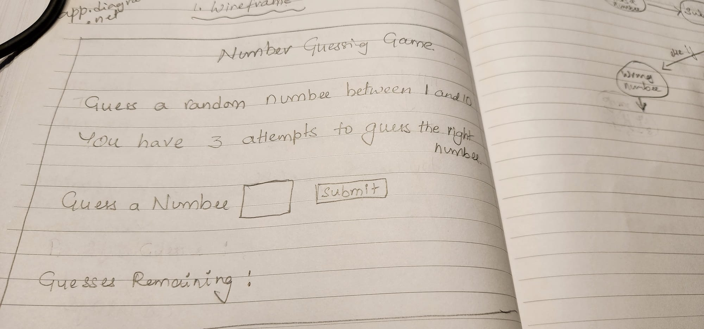
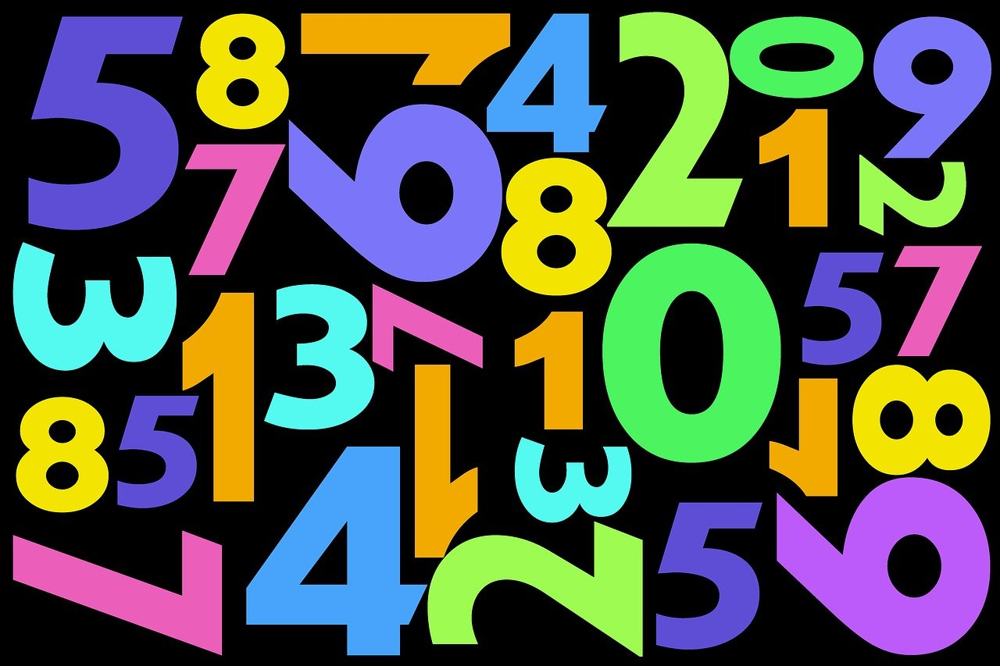

# Guess The Number Game

# instructions

User has three attempts to guess the number between 1-10.  Player enters a number and click the submit button, then the computer checks the number with the random generated number using and matches it and gives the output if the number is too low or too high. If the input number mathches with the random generated number then the player wins the game. If the player couldn't guess the number in three atempts then a message displays saying you are out of your attempts and gives the number. If the user enters any number out of range an error message will be displayed and the player loses an attempt. I have a Timeout() method to refresh the page after 5 seconds instead of reset button. I also added Trigger a Button Click on Enter to have an access to both sumbit and Enter button on the keyboard. The player has an option of 

# wireframe

# flowchart
(flowchart-pic.jpeg)
# image

# live site link

# Resource

1. miro.com
2. https://www.w3schools.com/howto/howto_js_trigger_button_enter.asp
3. https://www.w3schools.com/jsref/jsref_parseint.asp
4. https://www.w3schools.com/jsref/prop_html_innerhtml.asp
5. https://www.w3schools.com/cssref/pr_background-image.php
6. https://www.w3schools.com/jsref/event_onload.asp
7. https://pixabay.com/illustrations/pay-digit-number-abundance-count-2446661/
8. https://www.youtube.com/watch?v=2cQUkYU8AmI
9. https://www.tutorialspoint.com/How-to-delay-a-JavaScript-function-call-using-JavaScript
10. my instructor, Christina
11. my friends
12. my husband

